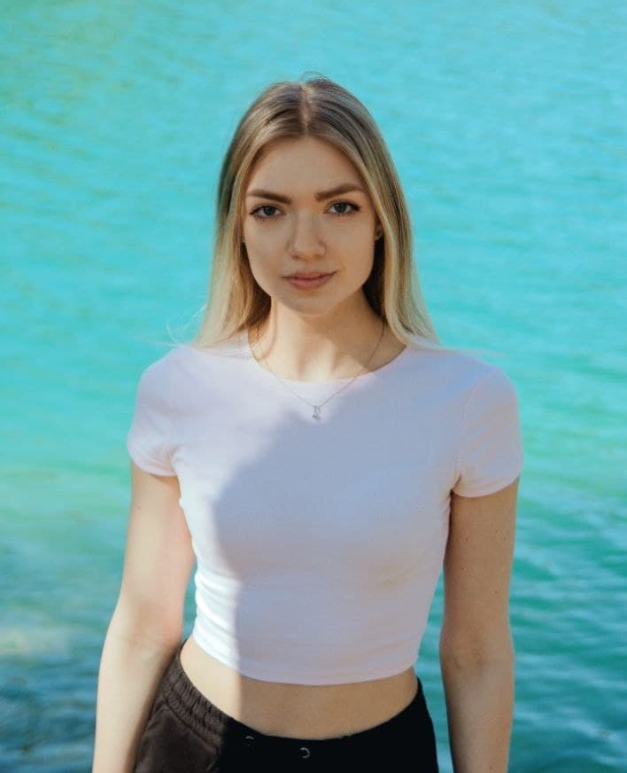

# Alena Sapotko



## _Contasts_

- _email: alena.dudareva1703@gmail.com_
- _Discourd-nickname: Alenasapotko#1859_

---

## Information about me

- _Nationality: Belarusian_
- _Hometown: Minsk_
- _Marital status: Married_
- _Date of birth: 17th March 1998_

### My skills:

Thanks to RS School now I know some basics of HTML, CSS. I also do have some experience of how to use Chrome DevTools, VSCode, Git and GitHub! Now I`m even able to make my own CV!

### My goals:

- feel myself as a _novice_ developer;
- learn the basics of HTML, CSS, Figma, JavaScript;
- safely continue my education on rs-school platform;
- finally become a **real** developer:)

### My strengths:

I`m a hightly motivated young person who is full of energy to study and constantly devolop my skills.

### Examples of Code

```javascript
const func = (num) => {
  if (num > 0) {
    return num - 1;
  }
  return num + 1;
};
```

### Experience

I only have the experience of working with HTML and CSS on platform https://ru.code-basics.com

### My education

I`ve graduated from Belarusian State Medical University, Faculty og General Medicine in 2021. Now I work as an Ophthalmologist in govermental clinic. RS School is my first training in the field of IT.

### Languages

- Russian: native
- English: B1+
- Polish: A1
